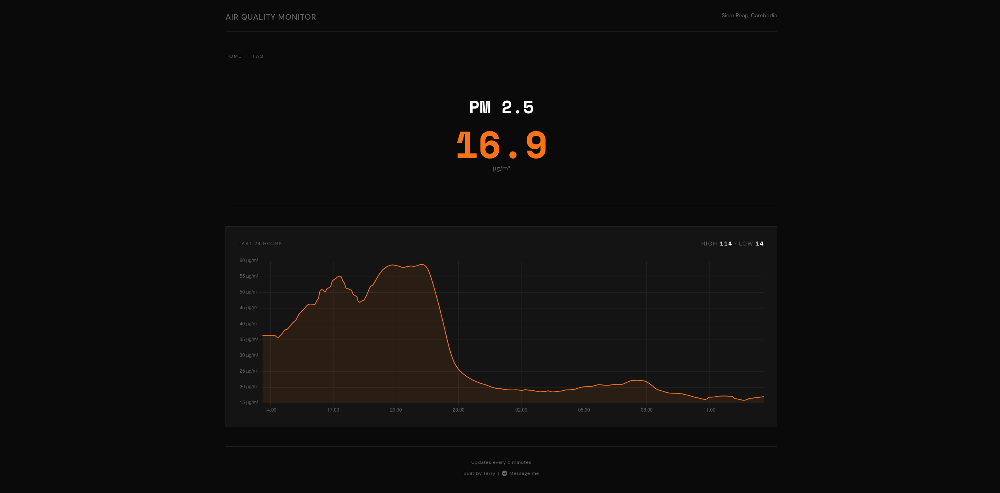
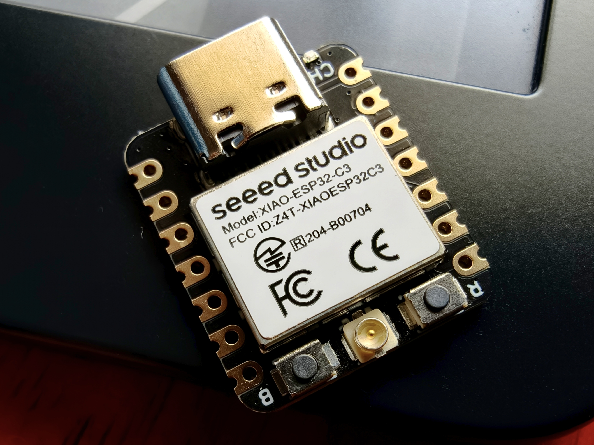
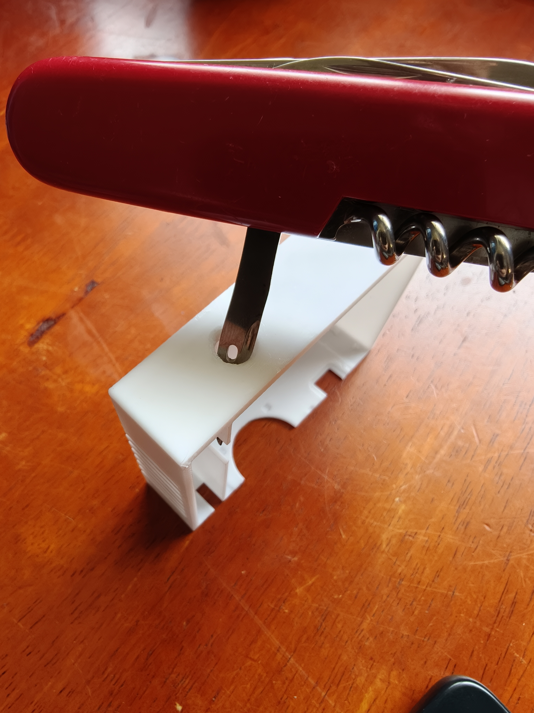
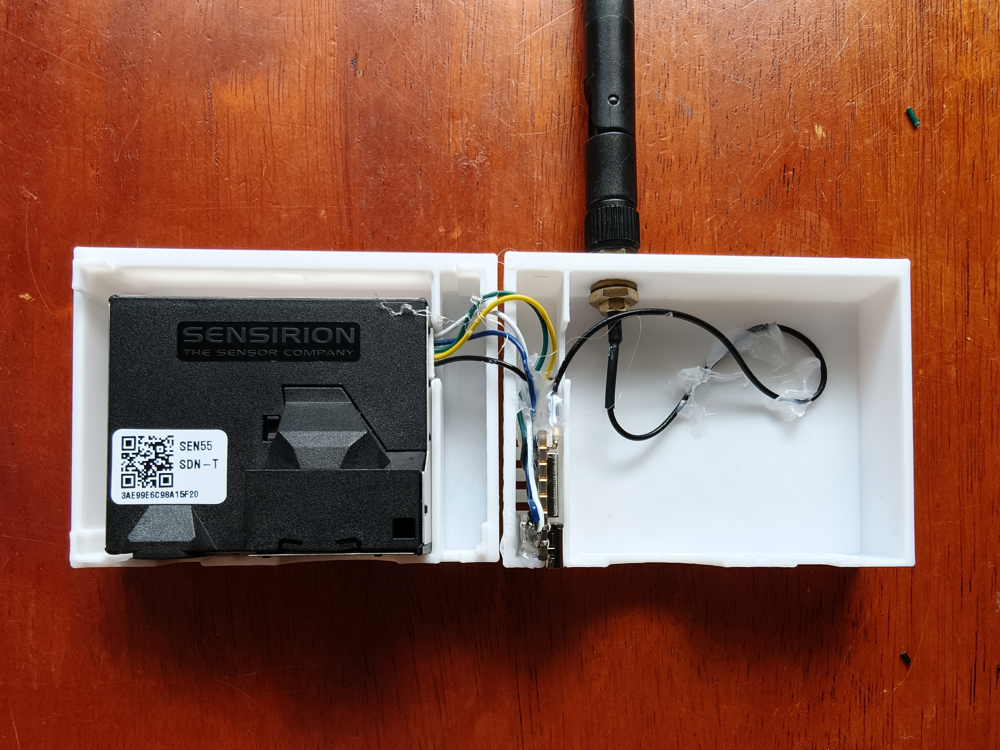
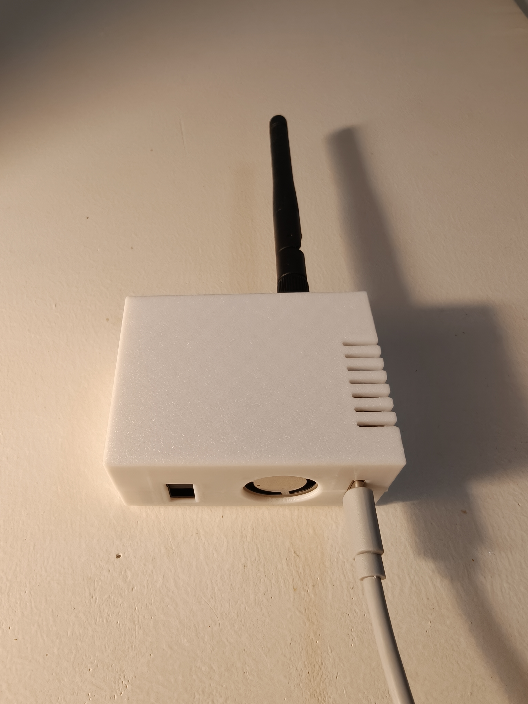

# air.siemreap.cloud

A personal project demonstrating real-time air quality and climate monitoring for Siem Reap, Cambodia. This project showcases integration of IoT sensors, Home Assistant automation, and full-stack web development.

**Live:** [air.siemreap.cloud](https://air.siemreap.cloud)

<table>
  <tr>
    <td align="center"> Home Page</td>
    <td align="center"> PM 2.5</td>
  </tr>
  <tr>
    <td align="center"> Humidity</td>
    <td align="center"> FAQ</td>
  </tr>
</table>

---

## What It Does

Pulls live sensor data from a physical IoT sensor in my apartment, processes it through a Python backend, and displays it on a public-facing web dashboard. Anyone can check current PM2.5, temperature, humidity, and other environmental metrics for my location in Siem Reap.

Each metric on the home page is clickable and will show a 24-hour line graph of the metric. It is only updated every 5 minutes to smooth out the line to view the trends better.

## Why I Built It

Siem Reap has very little public air quality monitoring. During burning season the air gets noticeably bad, but there's not much data to back it up. I wanted real numbers from my own location. Once I had the sensor running in Home Assistant, building a public-facing site around it was the next step.

## Technical Stack

| Layer | Technology |
|-------|-----------|
| Frontend | HTML / CSS / JavaScript |
| Backend | Python 3.12 + Flask + Gunicorn |
| Reverse proxy | Nginx |
| Containerization | Docker + Docker Compose |
| Data source | Home Assistant REST API |
| Sensor | SEN55 environmental sensor |
| Microcontroller | ESP32 C3 Mini | 

## Project Architecture

The Flask app polls Home Assistant's REST API on each request, applies PM2.5 correction algorithms, calculates derived metrics (heat index, dew point, AQI), and serves the dashboard. Everything runs in Docker on a local mini-PC server.

## Features

- Real-time AQI with PM2.5 correction
- Full environmental data: PM1.0, PM2.5, PM4.0, PM10, temperature, humidity, pressure
- Derived metrics: heat index, dew point
- Container health checks for reliability
- Sensor entities configurable via environment variables

---

## Hardware Build

The outdoor sensor unit is built from off-the-shelf components and a 3D-printed enclosure.

**Components**

| Part | Details |
|------|---------|
| Microcontroller | Seeed Studio XIAO ESP32-C3 (`XIAO-ESP32-C3`) |
| Sensor | Sensirion SEN55-SDN-T (PM1.0, PM2.5, PM4.0, PM10, temperature, humidity) |
| Enclosure | 3D-printed SEN55 case by [Syvel Engineering](https://makerworld.com/en/models/893126-sen55-air-quality-sensor-case?from=search#profileId-850164) |
| Antenna | External 2.4GHz Wi-Fi antenna via U.FL connector |

**Assembly**

The enclosure STL files were printed by [3D Print Cambodia](https://www.facebook.com/3D.PRINT.Cambodia69/) in Phnom Penh, who were able to ship to Siem Reap at a very reasonable price.

The case was originally designed for an ESP8266 dev board, so the XIAO ESP32-C3 — being much smaller — needed a small dab of hot glue to stay in place. The SEN55 fits snugly in the left chamber, with the ESP32-C3 and antenna cable routed into the right side.

The XIAO ESP32-C3 has an external antenna connector, so a hole was punched through the top of the case using the awl on a Swiss Army knife to pass the antenna cable through. The finished unit is mounted to the wall outdoors with blue sticky tack.

<table>
  <tr>
    <td align="center"> Seeed Studio XIAO ESP32-C3</td>
    <td align="center"> Punching the antenna hole with a Swiss Army knife awl</td>
  </tr>
  <tr>
    <td align="center"> SEN55, ESP32-C3, and antenna inside the case</td>
    <td align="center"> Finished unit mounted outdoors</td>
  </tr>
</table>

---

**This is a personal portfolio project showcasing IoT, automation, and full-stack development skills.**
